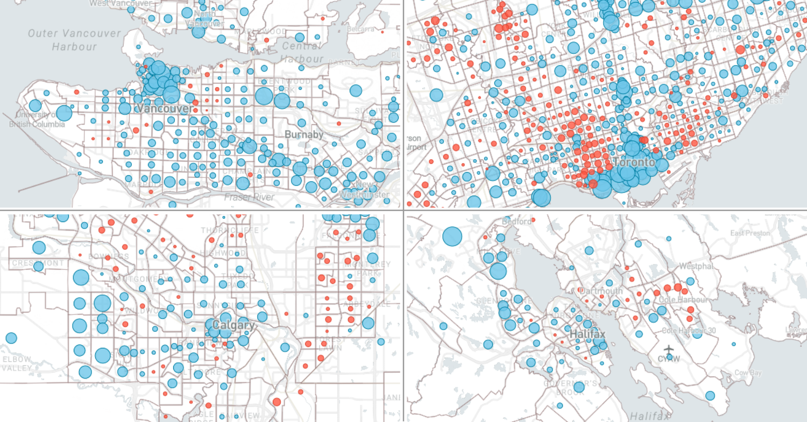

## Population Change in Canadian Cities (1996 to 2021)

Mapping 25 years of population growth and decline in Canadian urban regions

View the interactive map here: https://schoolofcities.github.io/population-change-canadian-cities-1996-2021/

